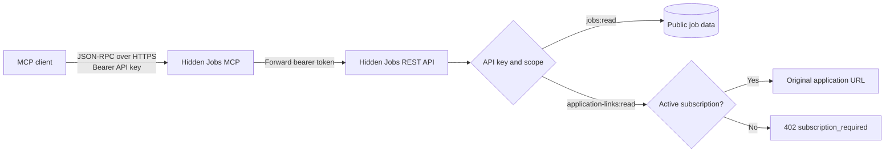
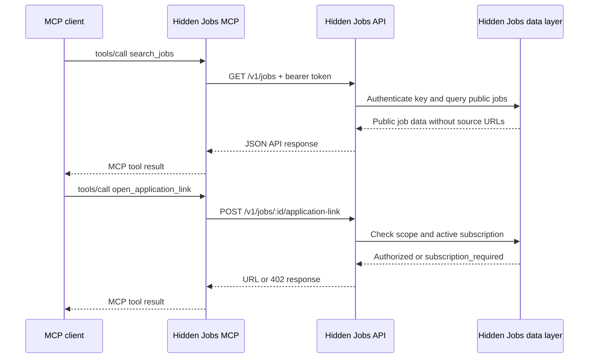

# Hidden Jobs MCP

Connect an MCP-compatible AI client to Hidden Jobs over Streamable HTTP.

The server lets an agent search remote technology jobs, read complete job descriptions, and retrieve the original application URL when the API key owner has the required Hidden Jobs Access subscription.

## Hosted server

The production MCP endpoint is already available:

```text
https://api.hiddenjobs.dev/mcp
```

Create a key in the [Hidden Jobs developer dashboard](https://hiddenjobs.dev/dashboard/api-keys), then add the endpoint and the key to your MCP client. The bearer token is forwarded to the Hidden Jobs API and is never replaced with a Supabase credential.

## Capabilities

| Tool | Required scope | Purpose |
| --- | --- | --- |
| `search_jobs` | `jobs:read` | Search the Hidden Jobs board with keywords and filters |
| `get_job` | `jobs:read` | Read public details and the full description for one offer |
| `open_application_link` | `application-links:read` plus an active subscription | Retrieve the original application URL for one offer |

Search and job-detail responses intentionally omit `url`, `application_url`, and `source_url`. They expose `hasApplicationLink` instead. The original URL is returned only by `open_application_link` after the API checks the key scope and the account subscription.

There is no auto-apply tool.

## Quick start

### 1. Create an API key

Create a Hidden Jobs API key with the `jobs:read` and `application-links:read` scopes. The dashboard shows the full key only once. Store it in your client's secret configuration.

### 2. Configure your MCP client

The configuration is the same for the hosted server and a self-hosted deployment. Replace the placeholder with your own key without committing it.

```json
{
  "mcpServers": {
    "hidden-jobs": {
      "url": "https://api.hiddenjobs.dev/mcp",
      "headers": {
        "Authorization": "Bearer hj_live_..."
      }
    }
  }
}
```

Ready-to-copy examples for common clients are in [`examples/`](examples/).

### 3. Ask your client

Try a request such as:

```text
Find remote TypeScript jobs in Europe and summarize the three best matches.
```

The client should call `search_jobs`, then call `get_job` for the offers it wants to inspect. It should call `open_application_link` only when the user asks to apply and the account has an active subscription.

## Architecture



The MCP adapter is deliberately thin. It handles MCP JSON-RPC messages, validates tool arguments, forwards the incoming bearer token to the REST API, and maps API errors into MCP tool results. Supabase is used by the deployed Edge Function as the runtime and by the underlying Hidden Jobs API. MCP clients never need a Supabase key.

## Request flow



## Protocol

The endpoint accepts MCP JSON-RPC 2.0 messages over HTTP `POST`.

| Method | Description |
| --- | --- |
| `initialize` | Negotiates protocol version and server capabilities |
| `ping` | Lightweight liveness request |
| `tools/list` | Lists the three available tools |
| `tools/call` | Executes a tool |
| `notifications/*` | Accepted with HTTP `202` and no response body |

The current protocol version is `2025-06-18`. See [`docs/protocol.md`](docs/protocol.md) for request and response examples.

## Self-host with Supabase Edge Functions

The repository contains the deployable function at [`supabase/functions/hidden-jobs-mcp/index.ts`](supabase/functions/hidden-jobs-mcp/index.ts).

### Requirements

- A Supabase project
- Supabase CLI
- Deno 2 for local checks
- A Hidden Jobs API key for client requests

### Deploy

```bash
supabase login
supabase link --project-ref <your-project-ref>
supabase functions deploy hidden-jobs-mcp --no-verify-jwt
supabase secrets set HIDDEN_JOBS_API_URL=https://api.hiddenjobs.dev/v1
```

`--no-verify-jwt` is intentional. The function authenticates the Hidden Jobs API bearer token itself, so Supabase must pass the request through instead of requiring a Supabase Auth JWT. The deployed Supabase runtime provides `SUPABASE_URL`. Set `SUPABASE_ANON_KEY` as a function secret only when your API deployment requires the upstream `apikey` header.

Detailed deployment notes, environment variables, and a custom API origin are in [`docs/deployment.md`](docs/deployment.md).

### Run locally

```bash
HIDDEN_JOBS_API_URL=https://api.hiddenjobs.dev/v1 SUPABASE_ANON_KEY=<supabase-anon-key> deno task start
```

The local server listens on Deno's default port. Set `HIDDEN_JOBS_MCP_URL` to the local URL when running the smoke test.

## Test and validate

Run the static checks:

```bash
deno task fmt
deno task check
```

Run the authenticated smoke test against the hosted or local server:

```bash
HIDDEN_JOBS_API_KEY=hj_live_... deno task smoke
```

The smoke test checks initialization, tool discovery, job search, and job detail without printing the API key or job application URLs. It does not call `open_application_link` unless `CHECK_APPLICATION_LINK=true` is set.

## Security model

- Treat an API key like a password
- Never commit a key, put it in a README, or paste it into an issue
- Store the key in the MCP client's secret store or an environment variable
- Rotate a key immediately if it is exposed
- Keep `SUPABASE_ANON_KEY` on the server side
- Never use a service-role key in an MCP client
- Search and job detail do not disclose original application URLs
- Application links are checked again on every request

See [`SECURITY.md`](SECURITY.md) for reporting and operational guidance.

## Repository layout

```text
.
├── README.md
├── SECURITY.md
├── deno.json
├── docs/
│   ├── client-configuration.md
│   ├── deployment.md
│   ├── protocol.md
│   └── tool-reference.md
├── examples/
├── scripts/
│   └── smoke-test.ts
└── supabase/
    ├── config.toml
    └── functions/
        ├── _shared/cors.ts
        └── hidden-jobs-mcp/index.ts
```

## License

MIT. See [`LICENSE`](LICENSE).
