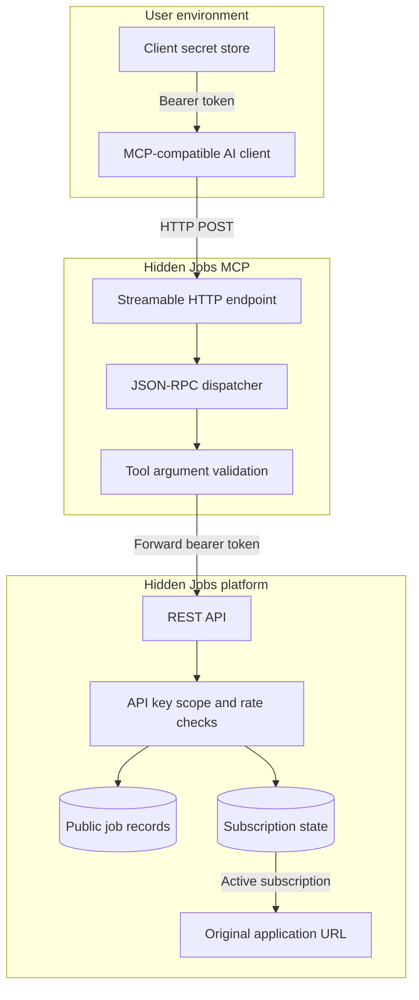

# Architecture

Hidden Jobs MCP is a protocol adapter. It does not maintain a second job database and it does not implement a second authorization model.

## Trust boundaries

### MCP client to MCP server

The client sends a Hidden Jobs API bearer key. The server does not receive a Supabase Auth session and does not need one.

### MCP server to REST API

The MCP adapter forwards the original `Authorization` header. The REST API remains the authority for key validity, scopes, rate limits, monthly usage, subscription checks, and URL release.

### Public job data to original URLs

`search_jobs` and `get_job` return descriptions and metadata but not the source URL. `open_application_link` is a separate operation with a separate scope and subscription check.

## Failure propagation

REST errors are converted into MCP tool errors. This preserves a readable message while retaining the original HTTP status and API code in `structuredContent` when available.
